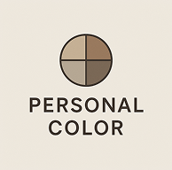

# 퍼스널컬러 자가진단 모던 웹앱

이 프로젝트는 **퍼스널컬러 자가진단**을 위한 모던 웹앱입니다. React, Vite, styled-components를 기반으로 빠르고 세련된 UI/UX를 제공합니다.

## 주요 특징

- 퍼스널컬러(봄웜, 여름쿨, 가을웜, 겨울쿨) 자가진단 설문
- 랜덤 7문항, 단계별 진행, 답변 선택 시 자동 진행
- 내추럴/뉴트럴톤의 고급스러운 디자인
- 반응형, 모바일/PC 모두 최적화
- styled-components 기반의 컴포넌트 스타일링

## 폴더 구조

```
├── public/
│   ├── personal_logo.png   # 프로젝트 대표 로고
│   └── personal_color.png  # 프로젝트 이미지
├── src/
│   ├── components/         # Question, ProgressBar, Result 등 UI 컴포넌트
│   ├── data/questions.js   # 퍼스널컬러 설문 데이터
│   ├── styles/             # GlobalStyle, theme.js 등 스타일
│   ├── App.jsx             # 메인 앱
│   └── ...
├── package.json
└── ...
```

## 기술 스택

- React (Vite 기반)
- styled-components
- JavaScript (ES6+)

## 실행 방법

1. 의존성 설치
   ```bash
   npm install
   ```
2. 개발 서버 실행
   ```bash
   npm run dev
   ```
3. 브라우저에서 `http://localhost:5173` 접속

## 기타

- 질문 데이터 및 스타일은 자유롭게 커스터마이즈 가능
- 결과 페이지(퍼스널컬러 진단 결과)는 src/components/Result.jsx에서 구현
